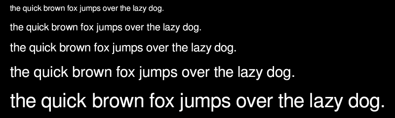

# prj-ttf-reader

prj-ttf-reader (library) is my personal experiment project to read opentype files.

If you need proper quality for opentype fonts, use freetype or similar.
There is plenty of things that would be nice to do, as listed in TODO.md

There is 3 parts in the project:
* Library (the prj-ttf-reader itself), written in c
* opengl-example, renders the prj-ttf-reader results in opengl program, written in c++
* unit tests, some basic tests for library, using googletest, written in c++

prj-ttf-reader was done on ubuntu 18.04.

## prj-ttf-reader library

prj-ttf-reader library contains the library (.so) that reads the opentype file,
parses it, and generates the glyphs on the data for use.

### Build and Installation

cd lib  
make  
sudo make install

### Clean and Uninstallation

make clean  
sudo make uninstall

## opengl-example

opengl-example uses the prj-ttf-reader library and draws the text in opengl.

### Development Environment

Required libraries: libglfw3-dev, libglew-dev  
Required internal libraries: prj-ttf-reader library

### Build

cd example  
make

### Running the opengl-example

Usage: ./opengl-example -s <"text string"> -f <"path to ttf"> -z <"font size">

For example:
./opengl-example -s "text goes here" -f "/tmp/font.ttf" -z 25

./opengl-example -s "the quick brown fox jumps over the lazy dog." -f "<"path to fonts">/freefont/FreeSans.ttf" -z 40  
./opengl-example -s "ગુજરાતી યુનિકોડ ફોન્ટ સૂચી" -f "<"path to fonts">/samyak-fonts/Samyak-Gujarati.ttf" -z 20  

### Clean

make clean

## unit tests

Unit tests is very basic tests for only some functionalities in the
prj-ttf-reader library.

### Development Environment

Required libraries: googletest

#### googletest instructions

URL: https://github.com/google/googletest.git  
Commit: 9a502a5b14b4a6160103c1f2c64331772878d86a

### Build

cd test  
make GOOGLETESTFOLDER=\<path to googletest\>

For example:
make GOOGLETESTFOLDER=/mnt/projects/googletest

### Running the unit tests

./unit_tests

## Example font rendering

FreeSans font:  
  

Samyak-Gujarati font:  

